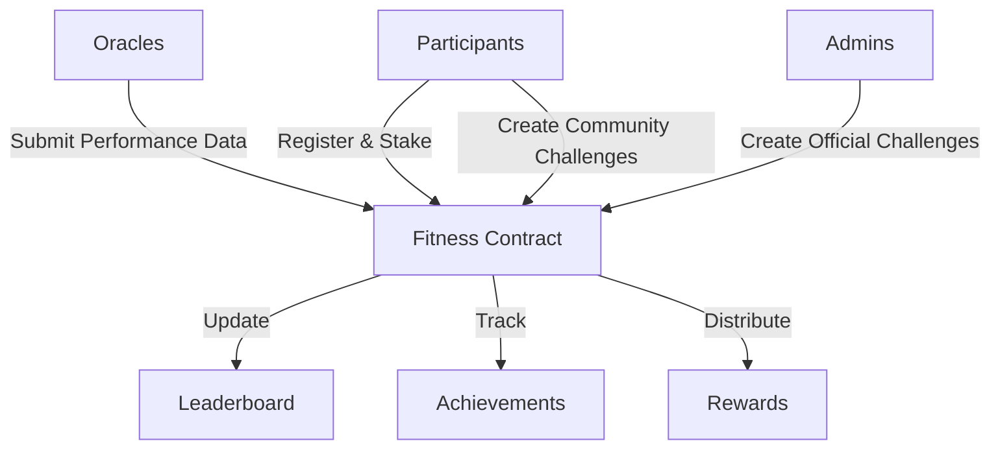

# Leverage Normalize: Fitness Challenge Platform

A decentralized blockchain platform for global fitness challenges, multi-metric performance tracking, and automated reward distribution.

## Overview

Leverage Normalize empowers users worldwide to participate in diverse fitness challenges on the blockchain. The platform revolutionizes fitness engagement through:

- Dynamic fitness challenge creation
- Multi-metric performance tracking
- Verifiable fitness data validation
- Transparent reward mechanisms
- Real-time performance leaderboards
- Both official and community-driven challenges
- Stake-based participation model

## Architecture

The Leverage Normalize system is powered by a sophisticated smart contract architecture:



### Core Components:
- Challenge Management Engine
- Participant Performance Tracking
- Multi-Metric Data Validation
- Achievement Recognition System
- Dynamic Reward Distribution
- Performance Leaderboard Mechanism

## Contract Documentation

### Fitness Stride Contract (`fitness-stride.clar`)

The core contract driving the Leverage Normalize ecosystem.

#### Key Features:
- Advanced role-based access control
- Flexible challenge creation protocols
- Comprehensive performance tracking
- Multi-dimensional achievement validation
- Adaptive reward distribution
- Real-time performance analytics

#### Access Control Hierarchy
- Platform Owner: Strategic governance
- Administrators: Challenge creation and platform management
- Performance Oracles: Verified data submission
- Community Users: Challenge participation and creation

## Getting Started

### Prerequisites
- Clarinet Development Environment
- Stacks Blockchain Wallet
- STX Tokens for Participation

### Basic Usage

1. **Creating a Fitness Challenge**
```clarity
(contract-call? .fitness-stride create-challenge
    "30-Day Fitness Transformation"
    "Achieve comprehensive fitness milestones"
    false  ;; community challenge
    u1234567890  ;; start time
    u1237246290  ;; end time
    u300000  ;; primary fitness goal
    u200000  ;; secondary performance metric
    u100000000  ;; entry fee in microSTX
    u100  ;; max participants
    u0)  ;; initial reward pool
```

2. **Challenge Registration**
```clarity
(contract-call? .fitness-stride register-for-challenge u1)
```

3. **Performance Data Submission**
```clarity
(contract-call? .fitness-stride submit-performance-data 
    u1  ;; challenge-id
    tx-sender  ;; participant
    u5000  ;; primary fitness points
    u4000)  ;; secondary metric
```

4. **Reward Claiming**
```clarity
(contract-call? .fitness-stride claim-rewards u1)
```

## Comprehensive Function Reference

### Administrative Capabilities
- Strategic contract ownership management
- Granular role assignment and revocation
- Challenge lifecycle control

### Challenge Orchestration
- Dynamic challenge creation
- Challenge termination mechanisms
- Flexible reward pool augmentation

### Participant Interactions
- Seamless challenge registration
- Performance tracking
- Reward claiming protocols

### Oracle Functions
- Verified performance data submission
- Multi-metric validation

### Read-Only Insights
- Comprehensive challenge details retrieval
- Participant performance analytics
- Dynamic leaderboard querying
- Achievement verification
- Predictive reward estimation

## Development Workflow

### Testing Protocols
```bash
# Execute comprehensive test suite
clarinet test

# Interactive contract console
clarinet console
```

### Local Development Setup
1. Repository cloning
2. Clarinet installation
3. Local contract deployment
```bash
clarinet deploy --local
```

## Security and Governance

### Architectural Limitations
- Oracle-dependent performance validation
- Leaderboard participant constraints
- Challenge duration parameters

### Robust Best Practices
- Rigorous challenge parameter validation
- Transaction confirmation strategies
- Anomaly detection in performance submissions
- Transparent reward calculation review

### Risk Mitigation Strategies
- Monotonic performance data validation
- Reward distribution lockup mechanisms
- Hierarchical access control
- Comprehensive challenge parameter validation

## Contributing

Interested in enhancing Leverage Normalize? Review our contribution guidelines and join our mission to gamify fitness through blockchain technology!